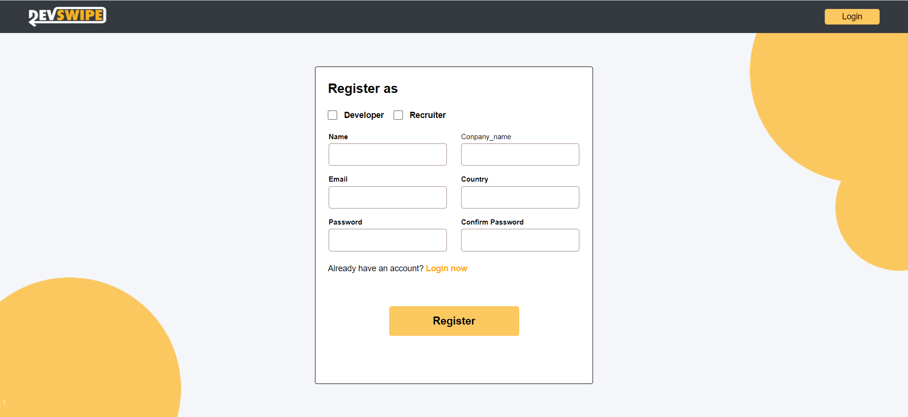
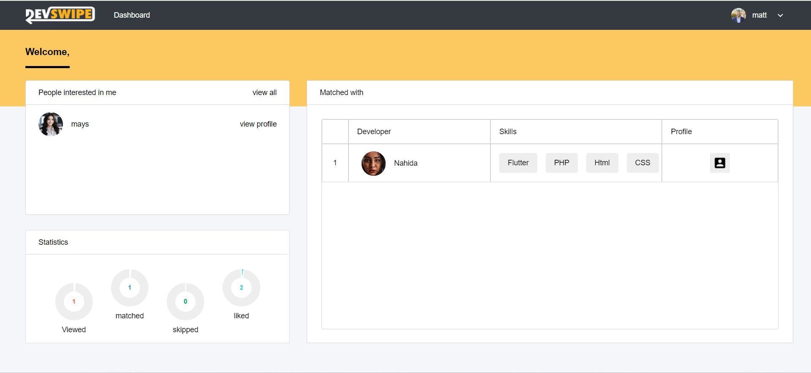
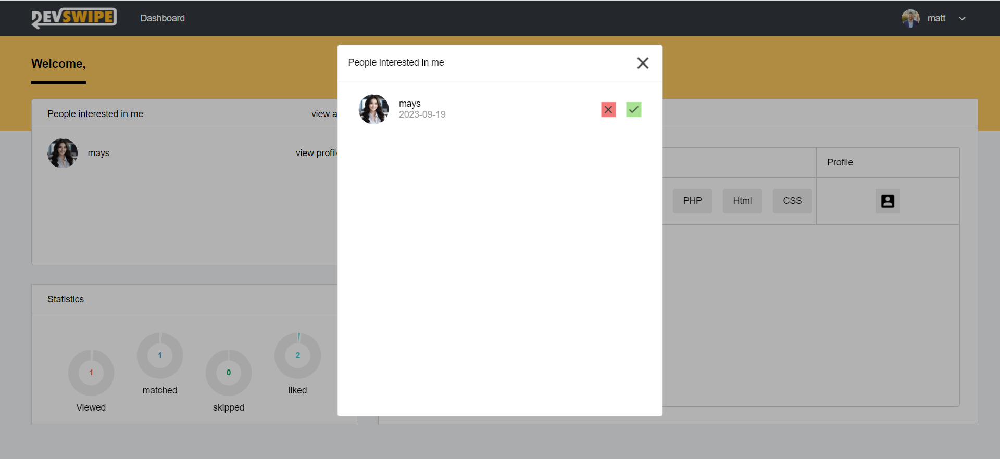
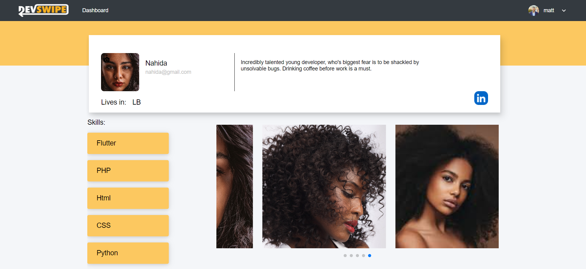
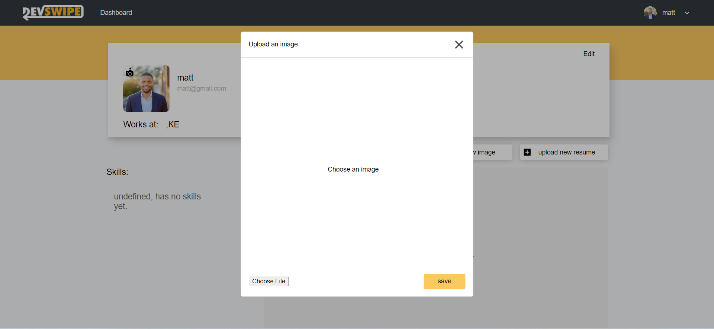
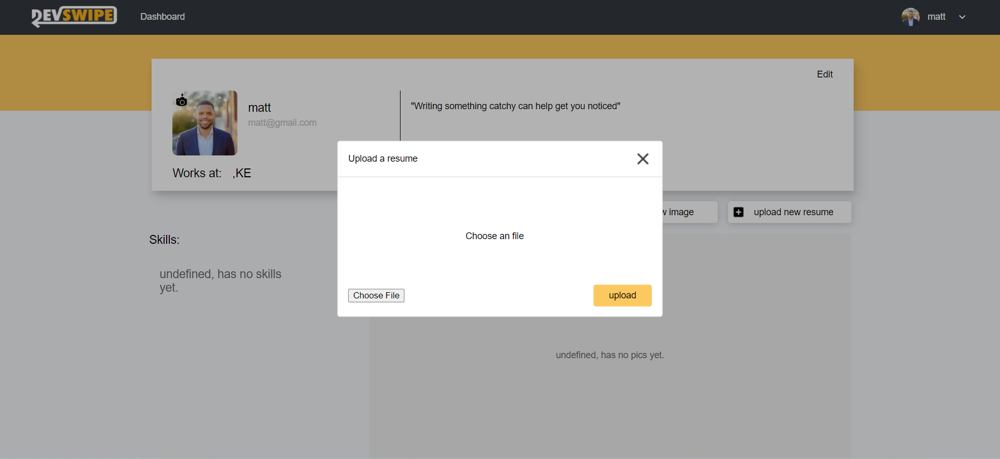
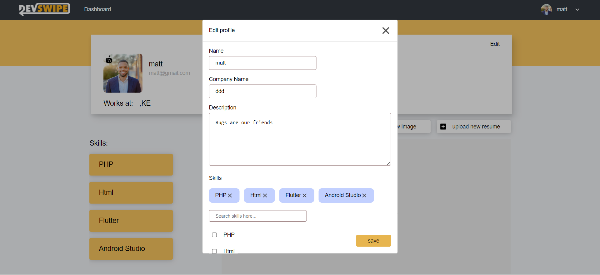

# DevSwipe: find your match at a finger's touch

<br><br>

<!-- project philosophy -->


> A multi platform service, that helps developers and recruiters meet their most suited companion easier.
>
> DevSwipe.
### User Stories
- As a user, I want to view opposite type users, so i can potentially find a person i am interested in.
- As a user, I want to swipe on a user, so i can match with them.
- As a user, I want to upload images, so viewers can make a well informed decision.
- As a user, I want to view my matches, so i can stay up to date on my contacts list.
- As a user, I want to update my skills, so i can grab potential recruiter's attention.

### Admin Stories
- As an admin, I want to view available users, so i can check their profiles.
- As an admin, I want to view analytics, so i can stay up to date.
- As an admin, I want to manage my users, so i can block or unblock them.
- As an admin, I want to view system skills, so i can edit, remove or add to them.

<br><br>

<!-- Prototyping -->


> We created three seperate platforms, each with a goal in mind.
> The website's intended use is for the users to register and manage their profiles, as well as stay up to date on their analytics.
> The Desk app's intended use is for the admin to be able to maintain their user base, as well as check up on their data.
> The mobile app's intended use is for the users to be able to interact with each other, swiping, viewing picks and getting background information about them.

<!-- Implementation -->


> Using the wireframes and mockups as a guide, we implemented the DevSwipe app with the following features:
### User Screens (Mobile)
| Login screen  | Landing screen | Profile |
| ---| ---| ---| ---|
|  |  |  |

### User Screens (Web)
| Login screen  | Register screen |  Dashboard screen |
| ---| ---| ---|
|  |  |  |
| Interested Modal | Profile Screen | Upload Image Screen |
|  |  |  |
| Upload CV  | Update User Details |
 | 

### Admin Screens (Desk)
| Login screen  | Dashboard screen |  Stats screen |
| ---| ---| ---|
|  |  |  |
| Developers screen  | Developers Profile Screen | Skills Screen 
|  |  |  
| Skills Modal One | Skills Modal Two |
|  |


<br><br>

<!-- Tech stack -->


###  DevSwipe is built using the following technologies:

- This project uses the [React-Native app development framework](https://flutter.dev/). React-Native is a cross-platform hybrid app development platform which allows us to use a single codebase for apps on mobile, desktop, and the web.
- This project uses the [React app development framework](https://flutter.dev/). React is a cross-platform hybrid app development platform which allows us to use a single codebase for apps on mobile, desktop, and the web.
- This project uses the [Electron app development framework](https://flutter.dev/). Electron is a cross-platform hybrid app development platform which allows us to use a single codebase for apps on mobile, desktop, and the web.
- For persistent storage (database), the app uses the [Hive](https://hivedb.dev/) package which allows the app to create a custom storage schema and save it to a local database.

<br><br>

<!-- How to run -->


> To set up Coffee Express locally, follow these steps:
### Prerequisites

This is an example of how to list things you need to use the software and how to install them.
* npm
  ```sh
  npm install npm@latest -g
  ```

### Installation

_Below is an example of how you can instruct your audience on installing and setting up your app. This template doesn't rely on any external dependencies or services._

1. Get a free API Key at [https://example.com](https://example.com)
2. Clone the repo
   ```sh
   git clone https://github.com/your_username_/Project-Name.git
   ```
3. Install NPM packages
   ```sh
   npm install
   ```
4. Enter your API in `config.js`
   ```js
   const API_KEY = 'ENTER YOUR API';
   ```

Now, you should be able to run Coffee Express locally and explore its features.
